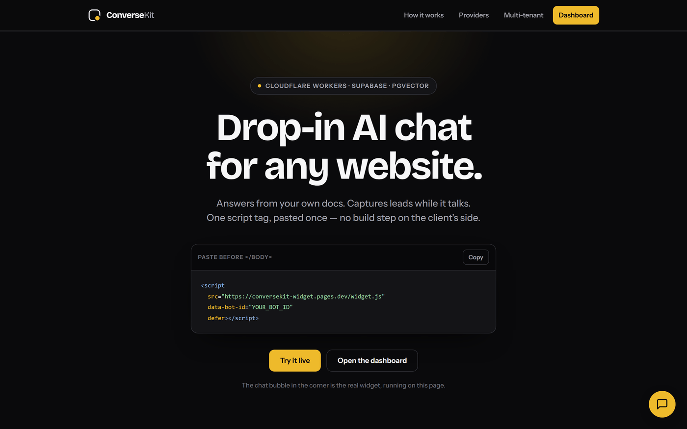
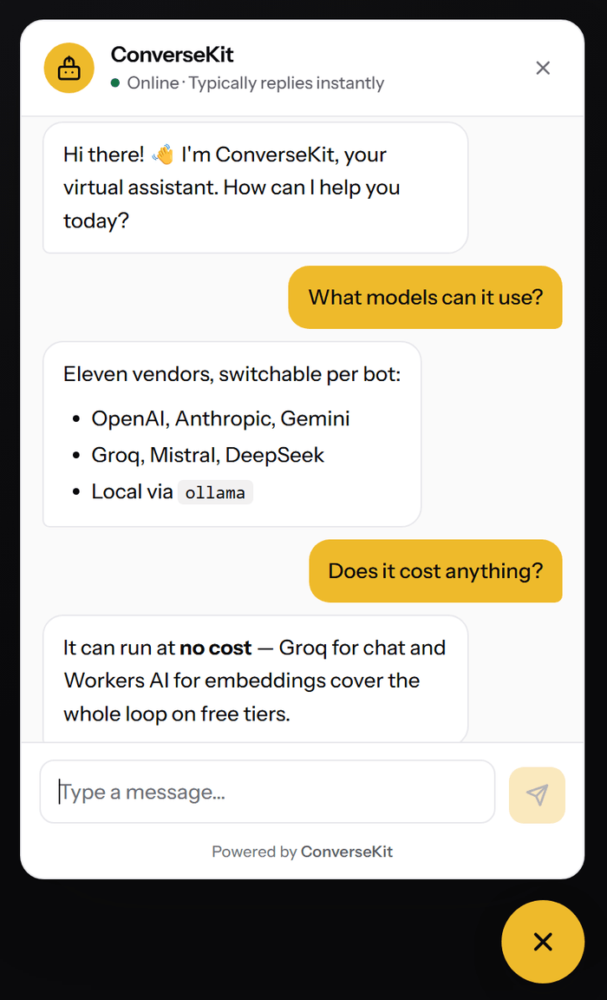

<div align="center">



# ConverseKit

**Drop-in AI chat for any website.** Answers from your own docs, captures leads
while it talks, installs with one `<script>` tag.

[](https://github.com/mukeremshifa/conversekit/actions/workflows/ci.yml)
[](https://conversekit-widget.pages.dev/)
[](LICENSE)

[Live site](https://conversekit-widget.pages.dev/) ·
[Dashboard](https://conversekit-widget.pages.dev/admin/) ·
[Documentation](#documentation)

</div>

---

## What it is

A multi-tenant conversational AI platform. One Cloudflare Worker serves the API
and one Pages site serves the widget and admin dashboard, together supporting an
unlimited number of client bots. Each bot is a row in Postgres with its own
branding, knowledge base, allowed origins and AI provider.

Onboarding a client is inserting a row and handing them a script tag. No
redeploy, and no build step on their side.

```html
<script
  src="https://conversekit-widget.pages.dev/widget.js"
  data-bot-id="YOUR_BOT_ID"
  defer></script>
```



### What it does

- **Answers from your documents.** Text, markdown and URLs become a searchable
  corpus. At question time the query is embedded and matched against that bot's
  chunks by cosine similarity, and the best passages go into the prompt.
- **Eleven AI vendors, one interface.** OpenAI, Anthropic, Gemini, Groq,
  OpenRouter, Mistral, Workers AI, DeepSeek, Together, Ollama and LM Studio,
  plus any OpenAI-compatible endpoint. Switching is a dropdown, per bot.
- **Runs at no cost.** Groq for chat and Workers AI for embeddings cover the
  whole loop on free tiers. That is the platform default, and it is verified
  rather than theoretical.
- **Captures leads.** The model collects a name, email or phone number
  mid-conversation and files it for CSV export.
- **Streams, with a net.** Replies arrive over SSE; a transport failure falls
  back to a buffered endpoint and the visitor still gets an answer.
- **Isolated by the database.** Row-level security keyed off organization
  membership, not application code that a refactor can quietly drop.
- **Origin-locked.** Each bot allows an explicit list of origins; a request from
  anywhere else is refused before the model is ever called.

<br clear="right">

## Stack

Cloudflare Workers · Hono · Cloudflare Pages · Supabase Postgres · pgvector ·
React + Vite + Tailwind v4

## Documentation

| Guide | What's in it |
|---|---|
| [Architecture](docs/architecture.md) | How the pieces fit together, and the repo layout |
| [AI providers](docs/providers.md) | The vendor catalog, resolution order, running for free |
| [Knowledge sources](docs/knowledge.md) | Chunking, embedding, retrieval, and its failure modes |
| [Tenancy and leads](docs/tenancy.md) | Organizations, RLS, the origin lock, lead capture |
| [API reference](docs/api.md) | Every route, with request and response shapes |
| [Operations](docs/operations.md) | Migrations, secrets, first-run, local dev, deploying |
| [Roadmap](docs/roadmap.md) | What is built, what is deferred, and why |

## Quick start

```bash
npm install                    # Worker dependencies
npm ci --prefix dashboard      # dashboard dependencies

npm run dev                    # Worker on localhost
npm run dashboard              # dashboard dev server

npm test                       # widget, session and RAG unit tests
npm run type-check             # tsc --noEmit
```

Full setup — migrations, secrets and the first bot — is in
[Operations](docs/operations.md).

## Live URLs

| What | URL |
|---|---|
| Landing page | https://conversekit-widget.pages.dev/ |
| Admin dashboard | https://conversekit-widget.pages.dev/admin/ |
| Widget script | https://conversekit-widget.pages.dev/widget.js |
| API Worker | https://conversekit.mukeremshifa.workers.dev |

## Widget API

Once loaded, the widget exposes a small global so a host page can drive it from
its own button:

```js
window.ConverseKit.open();      // open the panel
window.ConverseKit.close();
window.ConverseKit.toggle();
window.ConverseKit.isOpen();    // -> boolean
window.ConverseKit.version;     // -> "0.8.0"
```

## License

Proprietary — see [LICENSE](LICENSE). The source is public to read; it is not
open source, and no rights to use, deploy or redistribute it are granted.

Changes are recorded in [CHANGELOG.md](CHANGELOG.md).
